# Spark学习

## spark基础入门

### spark架构角色

- 资源层面：
  - master角色：集群资源管理；
  - worker角色：单机资源管理；
- 任务运行层面
  - driver：单个任务的资源管理；
  - executor角色：单个任务的计算（worker 干活 的）

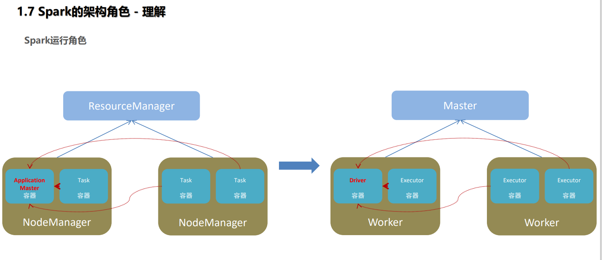

Spark中由4类角色组成整个Spark的运行环境

| Spark中角色  | 管理资源                               | 类比YARN                      |
| ------------ | -------------------------------------- | ----------------------------- |
| master角色   | 管理整个集群的资源                     | 类比于yarn的resoucemanager    |
| worker角色   | 管理单个服务器的资源                   | 类比于yarn的nodemanager       |
| driver角色   | 管理单个Spark任务在运行时候的工作      | 类比于yarn的APPlicationmaster |
| executor角色 | 单个任务运行的时候的一堆工作者，干活的 | 类比于yarn的容器内运行的task  |

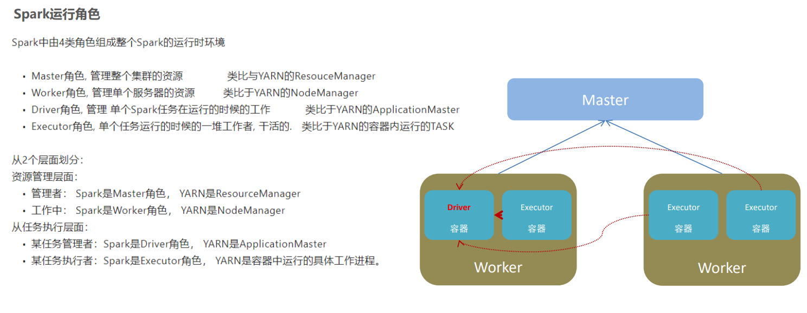

### Spark基础学习总价

spark用于解决什么问题？

> 海量数据的计算，可以进行离线批处理以及实时流计算；

spark有哪些模块？

> - 核心Sparkcore
> - SQL计算（SparkSQL）
> - 流计算（Sparkstreaming）
> - 图计算（graphx）
> - 机器学习（mllib）

Spark特点有哪些？

> - 速度快；
> - 使用简单；
> - 通用性强；
> - 多种模块运行；

Spark运行模式？

> - 本地模式；
> - 集群模式（standalone、yarn、K8S）
> - 云模式

Spark的运行角色（对比yarn）？

> - master：集群资源管理（类同ResouceManager）
> - worker：单机资源管理（类同nodemanager）
> - driver：单任务管理者（类同APPlicationmaster）
> - executor：单任务执行者（类同yarn容器内的task）


## Spark环境搭建

### 服务器环境搭建要求

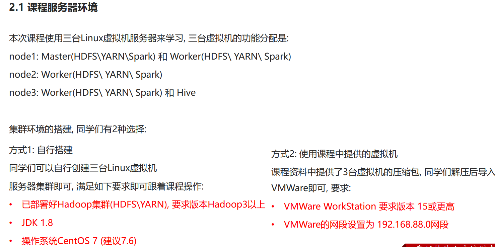


### 基本原理


> local模式只能运行一个Spark程序，如果执行多个Spark程序，那就是由多个相互独立的local进行执行


> local[4]就是有四个线程；
>
> 一个local模式是有一个jvm进程去提供，任务执行是在进程内部的线程来提供；
>
> 启动第二个任务，会开第二个jvm进程去运行→也就是说一个local只运行一个Spark程序；

### 配置虚拟机

①下载node1配置文件；

②加载到虚拟加中；

> 账号：root
>
> 密码：123456

③在虚拟网络编辑器中配置IP为192.168.88.0；

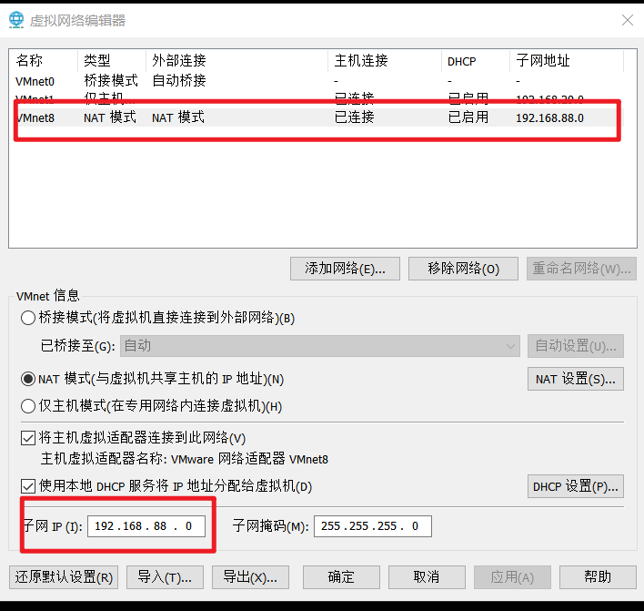

④虚拟机设置中，配置网络适配器为自定义，选择为上一步虚拟网络编辑中更改的那一个（例如VMnet8（NAT模式））

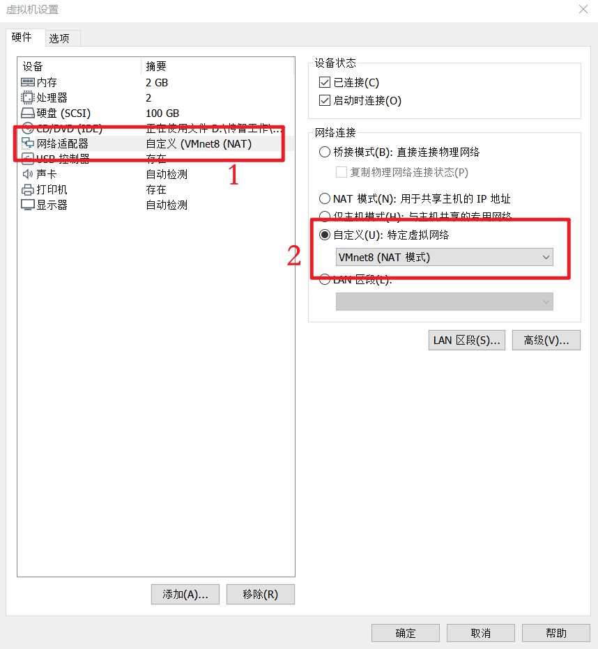

### 查看虚拟机ip

在虚拟机中输入`ip addr show`查看返回代码，其中`inet`后面的则为虚拟机ip `192.168.88.161`

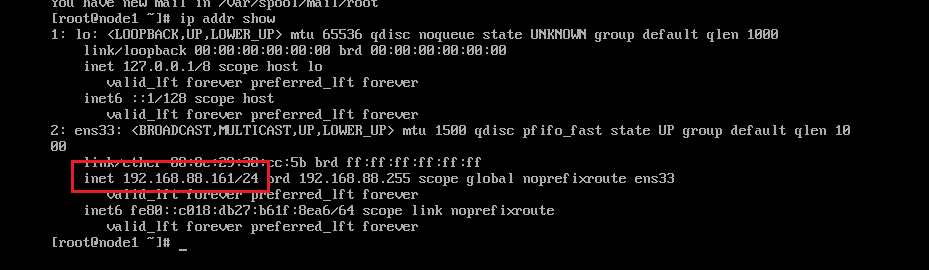

### 配置windterm

主机端口按照上一步查看的数据进行配置；

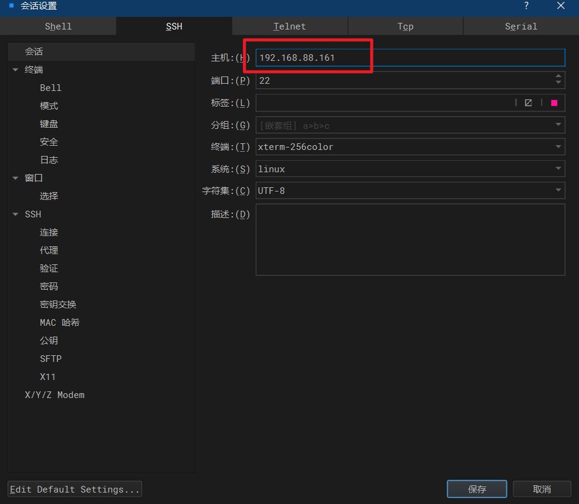

### 配置Anaconda

①下载`Anaconda3-2021.05-Linux-x86_64`文件，拖拉至`/export`目录中

查看没有

```shell
[root@node1 export]# ll
总用量 8
drwxr-xr-x  5 root root   54 10月 24 2021 data
drwxr-xr-x  2 root root   62 10月 24 2021 onekey
drwxr-xr-x 12 root root 4096 10月 24 2021 server
drwxr-xr-x  2 root root 4096 10月 24 2021 software
```

②拖拉过来后查看存在了；

```shell
[root@node1 export]# ll
总用量 557484
-rw-rw-rw-  1 root root 570853747 12月 18 11:55 Anaconda3-2021.05-Linux-x86_64.sh
drwxr-xr-x  5 root root        54 10月 24 2021 data
drwxr-xr-x  2 root root        62 10月 24 2021 onekey
drwxr-xr-x 12 root root      4096 10月 24 2021 server
drwxr-xr-x  2 root root      4096 10月 24 2021 software
```

③运行

```shell
[root@node1 export]# sh Anaconda3-2021.05-Linux-x86_64.sh
```

④安装过程中输入操作

> - 出现--More--  只用 
> - 按空格执行下一步就可以了；

> 出现这种选择`yes`即可
>
> ```shell
> Do you accept the license terms? [yes|no]
> [no] >>> yes
> ```

> 安装文件安装在那个地方，一般文件都是安装在根目录下的`/export/server/`目录下，后面跟安装软件的名字；
>
> ```shell
> [/root/anaconda3] >>> /export/server/anaconda3
> ```

> 是否对anaconda进行初始化；→恢复yes即可
>
> ```shell
> by running conda init? [yes|no]
> [no] >>> yes
> ```

安装完成后需要退出重进让anaconda环境生效；

> ```shell
> [root@node1 export]# exit
> 登出
> ```
>
> 连续两个回车，退出登录后再次进入

再次登录环境中；

> ```shell
> [root@node1 ~]# sudo su -
> ```
>
> 再次登录切换用户，<span style="color:#CC00CC;">显示前面没有（base）</span>，这个时候需要操作；
>
> ```shell
> [root@node1 ~]# conda activate base
> 
> (base) [root@node1 ~]# 
> ```
>
> 输入代码后前面显示出`base`了
>
> `base`表示的是基础的虚拟环境；

### Anaconda源修改

国外的源文件下载慢，修改为国内的源；

```shell
(base) [root@node1 ~]# vim ~/.condarc
```

在文件中复制超贴的代码

```shell
channels:
  - defaults
show_channel_urls: true
default_channels:
  - https://mirrors.tuna.tsinghua.edu.cn/anaconda/pkgs/main
  - https://mirrors.tuna.tsinghua.edu.cn/anaconda/pkgs/r
  - https://mirrors.tuna.tsinghua.edu.cn/anaconda/pkgs/msys2
custom_channels:
  conda-forge: https://mirrors.tuna.tsinghua.edu.cn/anaconda/cloud
  msys2: https://mirrors.tuna.tsinghua.edu.cn/anaconda/cloud
  bioconda: https://mirrors.tuna.tsinghua.edu.cn/anaconda/cloud
  menpo: https://mirrors.tuna.tsinghua.edu.cn/anaconda/cloud
  pytorch: https://mirrors.tuna.tsinghua.edu.cn/anaconda/cloud
  simpleitk: https://mirrors.tuna.tsinghua.edu.cn/anaconda/cloud
```

查看Python是否配置成功

```python
(base) [root@node1 ~]# python
Python 3.8.8 (default, Apr 13 2021, 19:58:26) 
[GCC 7.3.0] :: Anaconda, Inc. on linux
Type "help", "copyright", "credits" or "license" for more information.
>>> 
```

看到上面的代码显示安装是成功的，然后退出Python

```python
>>> exit()
```

### 配置pyspark虚拟环境

```shell
(base) [root@node1 ~]# conda create -n pyspark python=3.8
```

```shell
Proceed ([y]/n)? y
```

出现一下代码就显示配置完成了；

```python
Preparing transaction: done
Verifying transaction: done
Executing transaction: done
#
# To activate this environment, use
#
#     $ conda activate pyspark
#
# To deactivate an active environment, use
#
#     $ conda deactivate

```

如果想要切换虚拟环境，可以使用`conda activate pyspark`进行切换；

```shell
(base) [root@node1 ~]# conda activate pyspark
(pyspark) [root@node1 ~]# 
```

能够看出虚拟环境已经由`base`切换为`pyspark`

### Spark local部署

①将`spark-3.2.0-bin-hadoop3.2`压缩包加载到`/export/`目录中；→进入这个目录拖拽就可以了；

查看加载完成

```shell
(pyspark) [root@node1 export]# ll
总用量 851400
-rw-rw-rw-  1 root root 570853747 12月 18 11:55 Anaconda3-2021.05-Linux-x86_64.sh
drwxr-xr-x  5 root root        54 10月 24 2021 data
drwxr-xr-x  2 root root        62 10月 24 2021 onekey
drwxr-xr-x 13 root root      4096 12月 18 12:00 server
drwxr-xr-x  2 root root      4096 10月 24 2021 software
-rw-rw-rw-  1 root root 300965906 12月 17 19:25 spark-3.2.0-bin-hadoop3.2.tgz
```

② 解压这个压缩包到指定位置`/export/server/`；

```shell
(pyspark) [root@node1 export]# tar -zxvf spark-3.2.0-bin-hadoop3.2.tgz -C  /export/server/
```

查看目标目录下内容，显示已经解压完成；第21行代码为新解压进来的文件；

```shell
(pyspark) [root@node1 server]# ls -l
总用量 36
drwxr-xr-x 28 root  root   4096 12月 18 12:02 anaconda3
drwxr-xr-x  7 root  root    187 10月 24 2021 apache-flume-1.9.0-bin
drwxr-xr-x 10 root  root    201 10月 24 2021 apache-hive-3.1.2-bin
lrwxrwxrwx  1 root  root     13 10月 24 2021 flink -> flink-1.14.0/
drwxrwxr-x 10  1000  1000   156 9月  22 2021 flink-1.14.0
lrwxrwxrwx  1 root  root     23 10月 24 2021 flume -> apache-flume-1.9.0-bin/
lrwxrwxrwx  1 root  root     13 10月 24 2021 hadoop -> hadoop-3.3.0/
drwxr-xr-x 11 root  root    227 10月 24 2021 hadoop-3.3.0
lrwxrwxrwx  1 root  root     12 10月 24 2021 hbase -> hbase-2.1.0/
drwxr-xr-x  8 root  root    194 10月 24 2021 hbase-2.1.0
lrwxrwxrwx  1 root  root     22 10月 24 2021 hive -> apache-hive-3.1.2-bin/
drwxr-xr-x  7 10143 10143   245 12月 11 2019 jdk1.8.0_241
lrwxrwxrwx  1 root  root     17 10月 24 2021 kafka -> kafka_2.12-2.4.1/
drwxr-xr-x  8 root  root    113 10月 24 2021 kafka_2.12-2.4.1
lrwxrwxrwx  1 root  root     28 10月 24 2021 phoenix -> phoenix-hbase-2.1-5.1.2-bin/
drwxr-xr-x  5 root  root    189 1月  22 2020 phoenix-hbase-2.1-5.1.2-bin
lrwxrwxrwx  1 root  root     25 10月 24 2021 spark -> spark-3.1.2-bin-hadoop3.2
drwxr-xr-x 15  1000  1000   235 10月 24 2021 spark-3.1.2-bin-hadoop3.2
drwxr-xr-x 13  1000  1000   211 10月  6 2021 spark-3.2.0-bin-hadoop3.2
lrwxrwxrwx  1 root  root     16 10月 24 2021 zookeeper -> zookeeper-3.4.6/
drwxr-xr-x 11  1000  1000  4096 10月 24 2021 zookeeper-3.4.6
-rw-r--r--  1 root  root  28035 10月 24 2021 zookeeper.out
```

③因为文件名比较长，给这个文件起一个软连接；

```shell
(pyspark) [root@node1 server]# ln -s /export/server/spark-3.2.0-bin-hadoop3.2 /export/server/spark
```

能够看到第19行就是新起名字的别名

```shell
(pyspark) [root@node1 server]# ls -l
总用量 36
drwxr-xr-x 28 root  root   4096 12月 18 12:02 anaconda3
drwxr-xr-x  7 root  root    187 10月 24 2021 apache-flume-1.9.0-bin
drwxr-xr-x 10 root  root    201 10月 24 2021 apache-hive-3.1.2-bin
lrwxrwxrwx  1 root  root     13 10月 24 2021 flink -> flink-1.14.0/
drwxrwxr-x 10  1000  1000   156 9月  22 2021 flink-1.14.0
lrwxrwxrwx  1 root  root     23 10月 24 2021 flume -> apache-flume-1.9.0-bin/
lrwxrwxrwx  1 root  root     13 10月 24 2021 hadoop -> hadoop-3.3.0/
drwxr-xr-x 11 root  root    227 10月 24 2021 hadoop-3.3.0
lrwxrwxrwx  1 root  root     12 10月 24 2021 hbase -> hbase-2.1.0/
drwxr-xr-x  8 root  root    194 10月 24 2021 hbase-2.1.0
lrwxrwxrwx  1 root  root     22 10月 24 2021 hive -> apache-hive-3.1.2-bin/
drwxr-xr-x  7 10143 10143   245 12月 11 2019 jdk1.8.0_241
lrwxrwxrwx  1 root  root     17 10月 24 2021 kafka -> kafka_2.12-2.4.1/
drwxr-xr-x  8 root  root    113 10月 24 2021 kafka_2.12-2.4.1
lrwxrwxrwx  1 root  root     28 10月 24 2021 phoenix -> phoenix-hbase-2.1-5.1.2-bin/
drwxr-xr-x  5 root  root    189 1月  22 2020 phoenix-hbase-2.1-5.1.2-bin
lrwxrwxrwx  1 root  root     25 10月 24 2021 spark -> spark-3.1.2-bin-hadoop3.2
drwxr-xr-x 15  1000  1000   268 12月 18 17:44 spark-3.1.2-bin-hadoop3.2
drwxr-xr-x 13  1000  1000   211 10月  6 2021 spark-3.2.0-bin-hadoop3.2
lrwxrwxrwx  1 root  root     16 10月 24 2021 zookeeper -> zookeeper-3.4.6/
drwxr-xr-x 11  1000  1000  4096 10月 24 2021 zookeeper-3.4.6
-rw-r--r--  1 root  root  28035 10月 24 2021 zookeeper.out
```

### 配置spark的环境变量

配置Spark由如下5个环境变量需要设置


-  SPARK_HOME: 表示Spark安装路径在哪里 
-  PYSPARK_PYTHON: 表示Spark想运行Python程序, 那么去哪里找python执行器 
-  JAVA_HOME: 告知Spark Java在哪里 
-  HADOOP_CONF_DIR: 告知Spark Hadoop的配置文件在哪里 
-  HADOOP_HOME: 告知Spark  Hadoop安装在哪里 

<span style="background:#FF99FF;">这5个环境变量都需要配置在: `/etc/profile`中</span>

①变量配置对应参数

```shell
(pyspark) [root@node1 server]# vim /etc/profile
```

```shell
export JAVA_HOME=/export/server/jdk
export HADOOP_HOME=/export/server/hadoop
export SPARK_HOME=/export/server/spark
export PYSPARK_PYTHON=/export/server/anaconda3/envs/pyspark/bin/python3.8
export HADOOP_CONF_DIR=$HADOOP_HOME/etc/hadoop
```

②其中python需要新建一个标签页查找对应的文件路径；

```shell
[root@node1 ~]# cd /export/server/anaconda3/
[root@node1 anaconda3]# ll
总用量 212
drwxr-xr-x   2 root root 12288 12月 18 12:02 bin
drwxr-xr-x   2 root root    30 12月 18 12:02 compiler_compat
drwxr-xr-x   2 root root    19 12月 18 12:02 condabin
drwxr-xr-x   2 root root 20480 12月 18 12:02 conda-meta
drwxr-xr-x   3 root root    20 12月 18 12:02 doc
drwxr-xr-x   3 root root    49 12月 18 13:02 envs
drwxr-xr-x   7 root root    77 12月 18 12:02 etc
drwxr-xr-x  41 root root 12288 12月 18 12:02 include
drwxr-xr-x   3 root root    25 12月 18 12:02 info
drwxr-xr-x  23 root root 36864 12月 18 12:02 lib
drwxr-xr-x   4 root root    97 12月 18 12:02 libexec
-rw-r--r--   1 root root 10588 5月  14 2021 LICENSE.txt
drwxr-xr-x   3 root root    22 12月 18 12:02 licensing
drwxr-xr-x   3 root root    18 12月 18 12:02 man
drwxr-xr-x  65 root root  4096 12月 18 12:02 mkspecs
drwxr-xr-x   2 root root   252 12月 18 12:02 phrasebooks
drwxr-xr-x 408 root root 36864 12月 18 13:02 pkgs
drwxr-xr-x  27 root root  4096 12月 18 12:02 plugins
drwxr-xr-x  25 root root  4096 12月 18 12:02 qml
drwxr-xr-x   2 root root   175 12月 18 12:02 resources
drwxr-xr-x   2 root root   203 12月 18 12:02 sbin
drwxr-xr-x  30 root root  4096 12月 18 12:02 share
drwxr-xr-x   3 root root    22 12月 18 12:02 shell
drwxr-xr-x   3 root root   146 12月 18 12:02 ssl
drwxr-xr-x   3 root root 12288 12月 18 12:02 translations
drwxr-xr-x   3 root root    19 12月 18 12:02 var
drwxr-xr-x   3 root root    21 12月 18 12:02 x86_64-conda_cos6-linux-gnu
```

```shell
[root@node1 anaconda3]# cd envs
[root@node1 envs]# ll
总用量 0
drwxr-xr-x 11 root root 173 12月 18 13:02 pyspark
```

```shell
[root@node1 envs]# cd pyspark
[root@node1 pyspark]# ll
总用量 20
drwxr-xr-x  2 root root 4096 12月 18 13:02 bin
drwxr-xr-x  2 root root   30 12月 18 13:02 compiler_compat
drwxr-xr-x  2 root root 4096 12月 18 13:02 conda-meta
drwxr-xr-x  8 root root 4096 12月 18 13:02 include
drwxr-xr-x 16 root root 4096 12月 18 13:02 lib
drwxr-xr-x  9 root root  100 12月 18 13:02 share
drwxr-xr-x  3 root root  146 12月 18 13:02 ssl
drwxr-xr-x  3 root root   17 12月 18 13:02 x86_64-conda_cos7-linux-gnu
drwxr-xr-x  3 root root   17 12月 18 13:02 x86_64-conda-linux-gnu
```

此时查找中第3行代码 `python 3.8` 即为要寻找的目标文件，查找此时的路径，粘贴过去；

```shell
[root@node1 pyspark]# cd bin
[root@node1 bin]# ll
总用量 20224
lrwxrwxrwx 1 root root        8 12月 18 13:02 2to3 -> 2to3-3.8
-rwxrwxr-x 1 root root      128 12月 18 13:02 2to3-3.8
lrwxrwxrwx 1 root root        3 12月 18 13:02 captoinfo -> tic
-rwxrwxr-x 2 root root    14312 1月  26 2023 clear
-rwxrwxr-x 1 root root     6922 12月 18 13:02 c_rehash
lrwxrwxrwx 1 root root        7 12月 18 13:02 idle3 -> idle3.8
-rwxrwxr-x 1 root root      126 12月 18 13:02 idle3.8
-rwxrwxr-x 2 root root    63536 1月  26 2023 infocmp
lrwxrwxrwx 1 root root        3 12月 18 13:02 infotocap -> tic
lrwxrwxrwx 1 root root        2 12月 18 13:02 lzcat -> xz
lrwxrwxrwx 1 root root        6 12月 18 13:02 lzcmp -> xzdiff
lrwxrwxrwx 1 root root        6 12月 18 13:02 lzdiff -> xzdiff
lrwxrwxrwx 1 root root        6 12月 18 13:02 lzegrep -> xzgrep
lrwxrwxrwx 1 root root        6 12月 18 13:02 lzfgrep -> xzgrep
lrwxrwxrwx 1 root root        6 12月 18 13:02 lzgrep -> xzgrep
lrwxrwxrwx 1 root root        6 12月 18 13:02 lzless -> xzless
lrwxrwxrwx 1 root root        2 12月 18 13:02 lzma -> xz
-rwxrwxr-x 2 root root    17184 5月   1 2024 lzmadec
-rwxrwxr-x 1 root root    17016 12月 18 13:02 lzmainfo
lrwxrwxrwx 1 root root        6 12月 18 13:02 lzmore -> xzmore
-rwxrwxr-x 1 root root     9028 12月 18 13:02 ncursesw6-config
-rwxrwxr-x 2 root root   975784 9月   5 22:15 openssl
-rwxrwxr-x 1 root root      257 12月 18 13:02 pip
-rwxrwxr-x 1 root root      257 12月 18 13:02 pip3
lrwxrwxrwx 1 root root        8 12月 18 13:02 pydoc -> pydoc3.8
lrwxrwxrwx 1 root root        8 12月 18 13:02 pydoc3 -> pydoc3.8
-rwxrwxr-x 1 root root      111 12月 18 13:02 pydoc3.8
lrwxrwxrwx 1 root root        9 12月 18 13:02 python -> python3.8
lrwxrwxrwx 1 root root        9 12月 18 13:02 python3 -> python3.8
-rwxrwxr-x 1 root root 15160256 12月 18 13:02 python3.8
-rwxrwxr-x 1 root root     3524 12月 18 13:02 python3.8-config
lrwxrwxrwx 1 root root       16 12月 18 13:02 python3-config -> python3.8-config
lrwxrwxrwx 1 root root        4 12月 18 13:02 reset -> tset
-rwxrwxr-x 2 root root  1777144 4月  30 2024 sqlite3
-rwxrwxr-x 2 root root    30392 5月   4 2024 sqlite3_analyzer
-rwxrwxr-x 2 root root    22424 1月  26 2023 tabs
lrwxrwxrwx 1 root root        8 12月 18 13:02 tclsh -> tclsh8.6
-rwxrwxr-x 2 root root    15984 5月   4 2024 tclsh8.6
-rwxrwxr-x 2 root root    92248 1月  26 2023 tic
-rwxrwxr-x 2 root root    22424 1月  26 2023 toe
-rwxrwxr-x 2 root root    22528 1月  26 2023 tput
-rwxrwxr-x 2 root root    30696 1月  26 2023 tset
lrwxrwxrwx 1 root root        2 12月 18 13:02 unlzma -> xz
lrwxrwxrwx 1 root root        2 12月 18 13:02 unxz -> xz
-rwxrwxr-x 1 root root      244 12月 18 13:02 wheel
lrwxrwxrwx 1 root root        7 12月 18 13:02 wish -> wish8.6
-rwxrwxr-x 2 root root    16136 5月   4 2024 wish8.6
lrwxrwxrwx 1 root root       25 12月 18 13:02 x86_64-conda_cos7-linux-gnu-ld -> x86_64-conda-linux-gnu-ld
-rwxrwxr-x 2 root root  2195376 9月  26 15:36 x86_64-conda-linux-gnu-ld
-rwxrwxr-x 1 root root   103848 12月 18 13:02 xz
lrwxrwxrwx 1 root root        2 12月 18 13:02 xzcat -> xz
lrwxrwxrwx 1 root root        6 12月 18 13:02 xzcmp -> xzdiff
-rwxrwxr-x 2 root root    17184 5月   1 2024 xzdec
-rwxrwxr-x 2 root root     7422 5月   1 2024 xzdiff
lrwxrwxrwx 1 root root        6 12月 18 13:02 xzegrep -> xzgrep
lrwxrwxrwx 1 root root        6 12月 18 13:02 xzfgrep -> xzgrep
-rwxrwxr-x 2 root root    10333 5月   1 2024 xzgrep
-rwxrwxr-x 2 root root     1813 5月   1 2024 xzless
-rwxrwxr-x 2 root root     2190 5月   1 2024 xzmore
```

```shell
[root@node1 bin]# pwd
/export/server/anaconda3/envs/pyspark/bin
```

将这个路径粘贴到①中的`PYSPARK_PYTHON`中的配置变量路径中；

然后保存退出；

------

<span style="background:#FF99FF;">`PYSPARK_PYTHON`和 `JAVA_HOME` 需要同样配置在: `/root/.bashrc`中</span>

③编辑对应的文件

```shell
(pyspark) [root@node1 server]# vi ~/.bashrc
```

```shell
export JAVA_HOME=/export/server/jdk
export PYSPARK_PYTHON=/export/server/anaconda3/envs/pyspark/bin/python3.8
```

### 测试

```shell
pyspark) [root@node1 server]# cd /export/server/spark
您在 /var/spool/mail/root 中有新邮件
(pyspark) [root@node1 spark]# ll
总用量 128
drwxr-xr-x 2 1000 1000  4096 5月  24 2021 bin
drwxr-xr-x 2 1000 1000   304 10月 24 2021 conf
drwxr-xr-x 5 1000 1000    50 5月  24 2021 data
drwxr-xr-x 4 1000 1000    29 5月  24 2021 examples
drwxr-xr-x 2 1000 1000 12288 10月 24 2021 jars
drwxr-xr-x 4 1000 1000    38 5月  24 2021 kubernetes
-rw-r--r-- 1 1000 1000 23235 5月  24 2021 LICENSE
drwxr-xr-x 2 1000 1000  4096 5月  24 2021 licenses
drwxr-xr-x 2 root root  4096 10月 24 2021 logs
-rw-r--r-- 1 1000 1000 57677 5月  24 2021 NOTICE
drwxr-xr-x 9 1000 1000   327 5月  24 2021 python
drwxr-xr-x 3 1000 1000    17 5月  24 2021 R
-rw-r--r-- 1 1000 1000  4488 5月  24 2021 README.md
-rw-r--r-- 1 1000 1000   183 5月  24 2021 RELEASE
drwxr-xr-x 2 1000 1000  4096 5月  24 2021 sbin
lrwxrwxrwx 1 root root    40 12月 18 17:44 spark-3.2.0-bin-hadoop3.2 -> /export/server/spark-3.2.0-bin-hadoop3.2
drwxr-xr-x 3 root root    37 10月 24 2021 work
drwxr-xr-x 2 1000 1000    42 5月  24 2021 yarn
```

各种文件/目录代表的意思

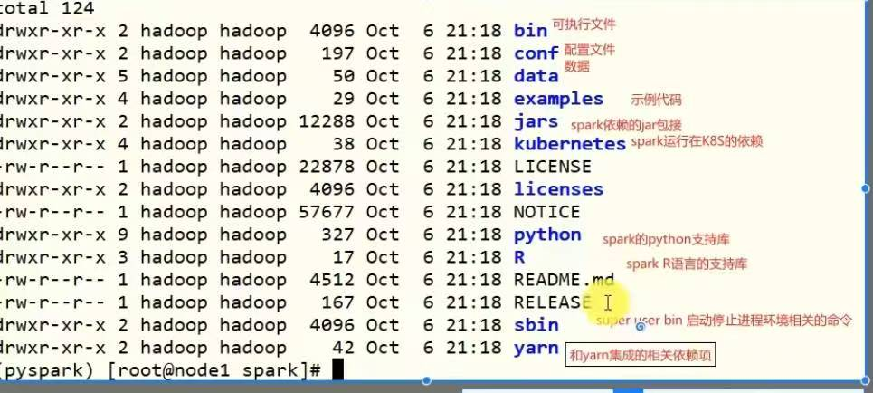

```shell
(pyspark) [root@node1 spark]# cd bin
您在 /var/spool/mail/root 中有新邮件
(pyspark) [root@node1 bin]# ll
总用量 116
-rwxr-xr-x 1 1000 1000  1089 5月  24 2021 beeline
-rw-r--r-- 1 1000 1000  1064 5月  24 2021 beeline.cmd
-rwxr-xr-x 1 1000 1000 10965 5月  24 2021 docker-image-tool.sh
-rwxr-xr-x 1 1000 1000  1935 5月  24 2021 find-spark-home
-rw-r--r-- 1 1000 1000  2685 5月  24 2021 find-spark-home.cmd
-rw-r--r-- 1 1000 1000  2337 5月  24 2021 load-spark-env.cmd
-rw-r--r-- 1 1000 1000  2435 5月  24 2021 load-spark-env.sh
-rwxr-xr-x 1 1000 1000  2634 5月  24 2021 pyspark
-rw-r--r-- 1 1000 1000  1540 5月  24 2021 pyspark2.cmd
-rw-r--r-- 1 1000 1000  1170 5月  24 2021 pyspark.cmd
-rwxr-xr-x 1 1000 1000  1030 5月  24 2021 run-example
-rw-r--r-- 1 1000 1000  1223 5月  24 2021 run-example.cmd
-rwxr-xr-x 1 1000 1000  3539 5月  24 2021 spark-class
-rwxr-xr-x 1 1000 1000  2812 5月  24 2021 spark-class2.cmd
-rw-r--r-- 1 1000 1000  1180 5月  24 2021 spark-class.cmd
-rwxr-xr-x 1 1000 1000  1039 5月  24 2021 sparkR
-rw-r--r-- 1 1000 1000  1097 5月  24 2021 sparkR2.cmd
-rw-r--r-- 1 1000 1000  1168 5月  24 2021 sparkR.cmd
-rwxr-xr-x 1 1000 1000  3122 5月  24 2021 spark-shell
-rw-r--r-- 1 1000 1000  1818 5月  24 2021 spark-shell2.cmd
-rw-r--r-- 1 1000 1000  1178 5月  24 2021 spark-shell.cmd
-rwxr-xr-x 1 1000 1000  1065 5月  24 2021 spark-sql
-rw-r--r-- 1 1000 1000  1118 5月  24 2021 spark-sql2.cmd
-rw-r--r-- 1 1000 1000  1173 5月  24 2021 spark-sql.cmd
-rwxr-xr-x 1 1000 1000  1040 5月  24 2021 spark-submit
-rw-r--r-- 1 1000 1000  1155 5月  24 2021 spark-submit2.cmd
-rw-r--r-- 1 1000 1000  1180 5月  24 2021 spark-submit.cmd
```

①启动pyspark

```python
(pyspark) [root@node1 bin]# ./pyspark
Python 3.8.20 (default, Oct  3 2024, 15:24:27) 
[GCC 11.2.0] :: Anaconda, Inc. on linux
Type "help", "copyright", "credits" or "license" for more information.
Setting default log level to "WARN".
To adjust logging level use sc.setLogLevel(newLevel). For SparkR, use setLogLevel(newLevel).
2024-12-18 19:54:25,032 WARN util.NativeCodeLoader: Unable to load native-hadoop library for your platform... using builtin-java classes where applicable
Welcome to
      ____              __
     / __/__  ___ _____/ /__
    _\ \/ _ \/ _ `/ __/  '_/
   /__ / .__/\_,_/_/ /_/\_\   version 3.2.0
      /_/

Using Python version 3.8.20 (default, Oct  3 2024 15:24:27)
Spark context Web UI available at http://node1:4040
Spark context available as 'sc' (master = local[*], app id = local-1734522866279).
SparkSession available as 'spark'.
```

> 显示正常进入`Spark`中，且版本号是3.2.0；
>
> 搭配的python版本号是3.8.20
>
> local[*] 表示有多少CPU核心，就可以在内部模拟多少工作的线程；

------

```python
>>> print("Im spark")
Im spark
```

```
>>> sc.parallelize([1,2,3,4,5]).map(lambda x:x*10).collect()
[10, 20, 30, 40, 50]   
```

------

②启动`spark-shell`

```python
(pyspark) [root@node1 bin]# ./spark-shell
Setting default log level to "WARN".
To adjust logging level use sc.setLogLevel(newLevel). For SparkR, use setLogLevel(newLevel).
2024-12-18 20:19:06,790 WARN util.NativeCodeLoader: Unable to load native-hadoop library for your platform... using builtin-java classes where applicable
Spark context Web UI available at http://node1:4040
Spark context available as 'sc' (master = local[*], app id = local-1734524347972).
Spark session available as 'spark'.
Welcome to
      ____              __
     / __/__  ___ _____/ /__
    _\ \/ _ \/ _ `/ __/  '_/
   /___/ .__/\_,_/_/ /_/\_\   version 3.2.0
      /_/
         
Using Scala version 2.12.15 (Java HotSpot(TM) 64-Bit Server VM, Java 1.8.0_241)
Type in expressions to have them evaluated.
Type :help for more information.
```

```
scala> sc.parallelize(Array(1,2,3,4,5)).map(x=>x*10).collect()
res0: Array[Int] = Array(10, 20, 30, 40, 50)    
```


```
(pyspark) [root@node1 bin]# ./spark-submit --master local[*] /export/server/spark/examples/src/main/python/pi.py 10
```

### local搭建总结：

local模式的运行原理？

> - local模式就是一以一个独立 进程配合其内部线程来提供 完成spark运行时环境；
> - local模式可以通过spark-shell/pyspark/spark-submit等开启；

bin/pyspark是什么程序？

> 是一个交互式的解释器执行环境，环境启动后就得到了一个local spark环境，可以运行python代码去进行spark计算，类似于python自带的解释器；

spark的4040端口是什么？

> spark的任务在运行后，会在driver所在的机器绑定到4040端口，提供当前任务的监控页面供查看；
>
> 如果端口被占用，会 打开新的端口；

## Standalone环境搭建

### standalone架构

> standalone是完整的spark运行环境，其中：
>
> master角色以master进程存在，worker角色以worker进程存在；
>
> driver角色在运行时存在于master进程内，executor运行于worker进程内；
>
> standalone是一个完全独立的集群架构；

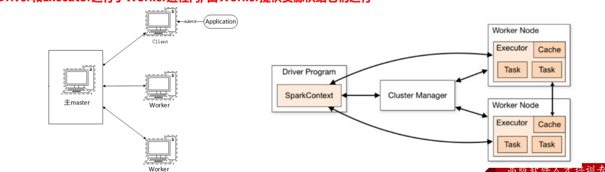

standalone是固定运行模式，一个master进程搭配三个worker进程；

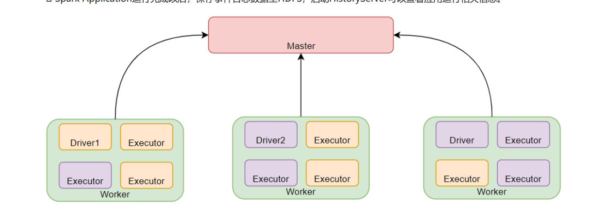

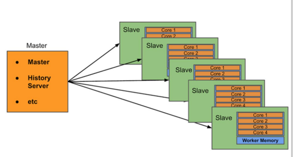

satandalone集群在进程上主要有3类进程：

> - 主节点master进程；
>   - master角色，管理整个集群资源，并托管运行各个任务的driver；
> - 从节点workers：
>   - worker角色，管理每个机器的资源，分配对应的资源来运行executor（task）；
>   - 每个从节点分配资源信息给worker管理，资源信息包含内存memory和CPU cores核数；
> - 历史服务器historyserver（可选）
>   - spark APPlication运行完成后，保存事件日志数据至hdfs，启动historyserver可以查看应用运行相关信息；

### standalone环境安装

集群规划

> 课程中 使用三台Linux虚拟机来组成集群环境, 非别是:
>
>
> node1\ node2\ node3
>
>
> node1运行: Spark的Master进程  和 1个Worker进程
>
>
> node2运行: spark的1个worker进程
>
>
> node3运行: spark的1个worker进程
>
>
> 整个集群提供: 1个master进程 和 3个worker进程

#### 安装包准备

①将虚拟机node2、node3分别加载到虚拟机中；

使用 `ip addr show`查看对应的ip 地址，在windterm中打开对应的会话窗口；

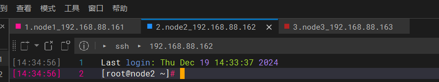

②将node1 中`anaconda3`安装包复制到node2 中

先查看node1 中文件位置，及 存在；

```shell
(pyspark) [root@node1 server]# cd ..
您在 /var/spool/mail/root 中有新邮件
(pyspark) [root@node1 export]# ll
总用量 851400
-rw-rw-rw-  1 root root 570853747 12月 18 11:55 Anaconda3-2021.05-Linux-x86_64.sh
drwxr-xr-x  5 root root        54 10月 24 2021 data
drwxr-xr-x  2 root root        62 10月 24 2021 onekey
drwxr-xr-x 14 root root      4096 12月 18 19:53 server
drwxr-xr-x  2 root root      4096 10月 24 2021 software
-rw-rw-rw-  1 root root 300965906 12月 17 19:25 spark-3.2.0-bin-hadoop3.2.tgz
```

在node2 中查看不存在`anaconda3`

```shell
[root@node2 ~]# cd ..
您在 /var/spool/mail/root 中有新邮件
[root@node2 /]# ll
总用量 24
lrwxrwxrwx.   1 root root    7 10月 19 2021 bin -> usr/bin
dr-xr-xr-x.   5 root root 4096 10月 19 2021 boot
drwxr-xr-x   20 root root 3240 12月 19 14:33 dev
drwxr-xr-x.  85 root root 8192 12月 19 14:33 etc
drwxr-xr-x    5 root root   48 10月 24 2021 export
drwxr-xr-x.   2 root root    6 4月  11 2018 home
lrwxrwxrwx.   1 root root    7 10月 19 2021 lib -> usr/lib
lrwxrwxrwx.   1 root root    9 10月 19 2021 lib64 -> usr/lib64
drwxr-xr-x.   2 root root    6 4月  11 2018 media
drwxr-xr-x.   2 root root    6 4月  11 2018 mnt
drwxr-xr-x.   3 root root   16 10月 19 2021 opt
dr-xr-xr-x  138 root root    0 12月 19 14:32 proc
dr-xr-x---.   7 root root  239 10月 24 2021 root
drwxr-xr-x   29 root root  820 12月 19 14:33 run
lrwxrwxrwx.   1 root root    8 10月 19 2021 sbin -> usr/sbin
drwxr-xr-x.   2 root root    6 4月  11 2018 srv
dr-xr-xr-x   13 root root    0 12月 19 14:32 sys
drwxrwxrwt.  34 root root 4096 12月 19 14:34 tmp
drwxr-xr-x.  13 root root  155 10月 19 2021 usr
drwxr-xr-x.  21 root root 4096 10月 19 2021 var
```

将node1中的`anaconda3`复制到node2中

```shell
(pyspark) [root@node1 export]# scp Anaconda3-2021.05-Linux-x86_64.sh node2:`pwd`/
Anaconda3-2021.05-Linux-x86_64.sh                                                 9%   52MB  13.7MB/s   00:35 ETA
```

等待复制完成；

③在node2 中查看anaconda3是否导入完成；显示已经复制完成了；

```shell
[root@node2 /]# cd /export
您在 /var/spool/mail/root 中有新邮件
[root@node2 export]# ll
总用量 557480
-rw-r--r--  1 root root 570853747 12月 19 14:47 Anaconda3-2021.05-Linux-x86_64.sh
drwxr-xr-x  3 root root        20 10月 24 2021 data
drwxr-xr-x 11 root root      4096 10月 24 2021 server
drwxr-xr-x  2 root root        83 10月 24 2021 software
```

④将node1 中`anaconda3`安装包复制到node3中

```shell
(pyspark) [root@node1 export]# scp Anaconda3-2021.05-Linux-x86_64.sh node3:`pwd`/
```

查看是否复制完成；显示复制完成；

```shell
[root@node3 ~]# cd /export
您在 /var/spool/mail/root 中有新邮件
[root@node3 export]# ll
总用量 557476
-rw-r--r--  1 root root 570853747 12月 19 14:49 Anaconda3-2021.05-Linux-x86_64.sh
drwxr-xr-x  3 root root        20 10月 24 2021 data
drwxr-xr-x 10 root root       310 10月 24 2021 server
drwxr-xr-x  2 root root        47 10月 24 2021 software
```

#### anaconda3安装

①在node2 中安装

```shell
[root@node2 export]# sh ./Anaconda3-2021.05-Linux-x86_64.sh

--More--  #出现这个按空格


Do you accept the license terms? [yes|no]
[no] >>> yes

[/root/anaconda3] >>> /export/server/anaconda3


```

②在node3中安装

```shell
[root@node3 export]# sh ./Anaconda3-2021.05-Linux-x86_64.sh

--More--  #出现这个按空格

Do you accept the license terms? [yes|no]
[no] >>> yes

[/root/anaconda3] >>> /export/server/anaconda3

by running conda init? [yes|no]
[no] >>> yes
```

#### 配置国内源

①在node2 中

```shell
[root@node2 export]# exit
登出
```

```shell
[root@node2 ~]# sudo su -
上一次登录：四 12月 19 15:05:48 CST 2024从 192.168.88.1pts/0 上
[root@node2 ~]# 
```

```shell
[root@node2 ~]# conda activate base
(base) [root@node2 ~]# 
```

验证python安装正常；

```shell
(base) [root@node2 ~]# python
Python 3.8.8 (default, Apr 13 2021, 19:58:26) 
[GCC 7.3.0] :: Anaconda, Inc. on linux
Type "help", "copyright", "credits" or "license" for more information.
```

②查看node1 中国内源代码，将其复制到node2中；

```shell
(pyspark) [root@node1 export]# cd
(pyspark) [root@node1 ~]# cat .condarc
channels:
  - defaults
show_channel_urls: true
default_channels:
  - https://mirrors.tuna.tsinghua.edu.cn/anaconda/pkgs/main
  - https://mirrors.tuna.tsinghua.edu.cn/anaconda/pkgs/r
  - https://mirrors.tuna.tsinghua.edu.cn/anaconda/pkgs/msys2
custom_channels:
  conda-forge: https://mirrors.tuna.tsinghua.edu.cn/anaconda/cloud
  msys2: https://mirrors.tuna.tsinghua.edu.cn/anaconda/cloud
  bioconda: https://mirrors.tuna.tsinghua.edu.cn/anaconda/cloud
  menpo: https://mirrors.tuna.tsinghua.edu.cn/anaconda/cloud
  pytorch: https://mirrors.tuna.tsinghua.edu.cn/anaconda/cloud
  simpleitk: https://mirrors.tuna.tsinghua.edu.cn/anaconda/cloud
```

③将node1中复制的文件粘贴到node2中，点击保存；

```shell
(base) [root@node2 ~]# vim ~/.condarc
```

④在node3中执行同样 的操作；验证怕python安装正常；

```shell
(base) [root@node3 ~]# python
Python 3.8.8 (default, Apr 13 2021, 19:58:26) 
[GCC 7.3.0] :: Anaconda, Inc. on linux
Type "help", "copyright", "credits" or "license" for more information.
>>> 
```

#### 创建pyspark的虚拟环境

①在node2中创建

```shell
(base) [root@node2 ~]# conda create -n pyspark python=3.8

Proceed ([y]/n)? y    #回复y表示同意安装；
```

验证是否安装完成；显示切换到python 环境中

```shell
(base) [root@node2 ~]# conda activate pyspark
(pyspark) [root@node2 ~]# 
```

```shell
(pyspark) [root@node2 ~]# python
Python 3.8.20 (default, Oct  3 2024, 15:24:27) 
[GCC 11.2.0] :: Anaconda, Inc. on linux
Type "help", "copyright", "credits" or "license" for more information.
>>> 
```

②在node3中创建

```shell
(base) [root@node3 ~]# conda create -n pyspark python=3.8

Proceed ([y]/n)? y    #回复y表示同意安装；
```

验证是否安装完成；显示切换到python 环境中

```shell
(base) [root@node3 ~]# conda activate pyspark
您在 /var/spool/mail/root 中有新邮件
(pyspark) [root@node3 ~]# 
```

```shell
(pyspark) [root@node3 ~]# python
Python 3.8.20 (default, Oct  3 2024, 15:24:27) 
[GCC 11.2.0] :: Anaconda, Inc. on linux
Type "help", "copyright", "credits" or "license" for more information.
```

#### 配置环境变量

①查看node1中当时配置的环境变量；

```shell
(pyspark) [root@node1 ~]# vim /etc/profile
```

```shell
export SPARK_HOME=/export/server/spark
export PYSPARK_PYTHON=/export/server/anaconda3/envs/pyspark/bin/python3.8
export HADOOP_CONF_DIR=$HADOOP_HOME/etc/hadoop
```

②在node2中配置相应的环境变量

```shell
(pyspark) [root@node2 ~]# vim /etc/profile
```

③在node3中配置相应的环境变量

```shell
(pyspark) [root@node3 ~]# vim /etc/profile
```

④查看node1中的`bashrc`环境变量

```shell
(pyspark) [root@node1 ~]# vim .bashrc
```

```shell
export JAVA_HOME=/export/server/jdk
export PYSPARK_PYTHON=/export/server/anaconda3/envs/pyspark/bin/python3.8
```

⑤在node2中配置相关变量

```shell
(pyspark) [root@node2 ~]# vim .bashrc
```

⑥在node3中配置相关变量

```shell
(pyspark) [root@node3 ~]# vim .bashrc
```

#### 修改spark的配置文件

> 为了让spark拥有最大的hdfs权限，spark安装也使用Hadoop用户

①在node1中将用户改为hadoop用户；

```shell
(base) [root@node1 ~]# cd /export/server/
(base) [root@node1 server]# ll
总用量 36
drwxr-xr-x 28 root  root   4096 12月 18 12:02 anaconda3
drwxr-xr-x  7 root  root    187 10月 24 2021 apache-flume-1.9.0-bin
drwxr-xr-x 10 root  root    201 10月 24 2021 apache-hive-3.1.2-bin
lrwxrwxrwx  1 root  root     13 10月 24 2021 flink -> flink-1.14.0/
drwxrwxr-x 10  1000  1000   156 9月  22 2021 flink-1.14.0
lrwxrwxrwx  1 root  root     23 10月 24 2021 flume -> apache-flume-1.9.0-bin/
lrwxrwxrwx  1 root  root     13 10月 24 2021 hadoop -> hadoop-3.3.0/
drwxr-xr-x 11 root  root    227 10月 24 2021 hadoop-3.3.0
lrwxrwxrwx  1 root  root     12 10月 24 2021 hbase -> hbase-2.1.0/
drwxr-xr-x  8 root  root    194 10月 24 2021 hbase-2.1.0
lrwxrwxrwx  1 root  root     22 10月 24 2021 hive -> apache-hive-3.1.2-bin/
lrwxrwxrwx  1 root  root     27 12月 18 19:53 jdk -> /export/server/jdk1.8.0_241
drwxr-xr-x  7 10143 10143   245 12月 11 2019 jdk1.8.0_241
lrwxrwxrwx  1 root  root     17 10月 24 2021 kafka -> kafka_2.12-2.4.1/
drwxr-xr-x  8 root  root    113 10月 24 2021 kafka_2.12-2.4.1
lrwxrwxrwx  1 root  root     28 10月 24 2021 phoenix -> phoenix-hbase-2.1-5.1.2-bin/
drwxr-xr-x  5 root  root    189 1月  22 2020 phoenix-hbase-2.1-5.1.2-bin
lrwxrwxrwx  1 root  root     40 12月 18 19:48 spark -> /export/server/spark-3.2.0-bin-hadoop3.2
drwxr-xr-x 15  1000  1000   268 12月 18 17:44 spark-3.1.2-bin-hadoop3.2
drwxr-xr-x 13  1000  1000   211 10月  6 2021 spark-3.2.0-bin-hadoop3.2
lrwxrwxrwx  1 root  root     16 10月 24 2021 zookeeper -> zookeeper-3.4.6/
drwxr-xr-x 11  1000  1000  4096 10月 24 2021 zookeeper-3.4.6
-rw-r--r--  1 root  root  28035 10月 24 2021 zookeeper.out
```

显示spark用户为root：root，需要将其更改为hadoop

②更改用户

```shell
(base) [root@node1 server]# chown -R hadoop:hadoop spark*
chown: 无效的用户: "hadoop:hadoop"
```

此时是因为没有Hadoop用户，需要创建一个Hadoop用户；再次执行

```shell
(base) [root@node1 server]# sudo  -m hadoop -s /bin/bash
```

更改用户显示成功；

```shell
(base) [root@node1 server]# chown -R hadoop:hadoop spark*
```

```shell
(base) [root@node1 server]# ll
总用量 36
drwxr-xr-x 28 root   root    4096 12月 18 12:02 anaconda3
drwxr-xr-x  7 root   root     187 10月 24 2021 apache-flume-1.9.0-bin
drwxr-xr-x 10 root   root     201 10月 24 2021 apache-hive-3.1.2-bin
lrwxrwxrwx  1 root   root      13 10月 24 2021 flink -> flink-1.14.0/
drwxrwxr-x 10 hadoop hadoop   156 9月  22 2021 flink-1.14.0
lrwxrwxrwx  1 root   root      23 10月 24 2021 flume -> apache-flume-1.9.0-bin/
lrwxrwxrwx  1 root   root      13 10月 24 2021 hadoop -> hadoop-3.3.0/
drwxr-xr-x 11 root   root     227 10月 24 2021 hadoop-3.3.0
lrwxrwxrwx  1 root   root      12 10月 24 2021 hbase -> hbase-2.1.0/
drwxr-xr-x  8 root   root     194 10月 24 2021 hbase-2.1.0
lrwxrwxrwx  1 root   root      22 10月 24 2021 hive -> apache-hive-3.1.2-bin/
lrwxrwxrwx  1 root   root      27 12月 18 19:53 jdk -> /export/server/jdk1.8.0_241
drwxr-xr-x  7  10143  10143   245 12月 11 2019 jdk1.8.0_241
lrwxrwxrwx  1 root   root      17 10月 24 2021 kafka -> kafka_2.12-2.4.1/
drwxr-xr-x  8 root   root     113 10月 24 2021 kafka_2.12-2.4.1
lrwxrwxrwx  1 root   root      28 10月 24 2021 phoenix -> phoenix-hbase-2.1-5.1.2-bin/
drwxr-xr-x  5 root   root     189 1月  22 2020 phoenix-hbase-2.1-5.1.2-bin
lrwxrwxrwx  1 hadoop hadoop    40 12月 18 19:48 spark -> /export/server/spark-3.2.0-bin-hadoop3.2
drwxr-xr-x 15 hadoop hadoop   268 12月 18 17:44 spark-3.1.2-bin-hadoop3.2
drwxr-xr-x 13 hadoop hadoop   211 10月  6 2021 spark-3.2.0-bin-hadoop3.2
lrwxrwxrwx  1 root   root      16 10月 24 2021 zookeeper -> zookeeper-3.4.6/
drwxr-xr-x 11 hadoop hadoop  4096 10月 24 2021 zookeeper-3.4.6
-rw-r--r--  1 root   root   28035 10月 24 2021 zookeeper.out
```

显示所有包含spark文件/目录的用户都更改为Hadoop了

③切换为Hadoop用户

```shell
(base) [root@node1 server]# su - hadoop
[hadoop@node1 ~]$ 
```

④修改spark的配置文件；

```shell
[hadoop@node1 ~]$ cd /export/server/spark
[hadoop@node1 spark]$ ll
总用量 124
drwxr-xr-x 2 hadoop hadoop  4096 12月 18 20:31 bin
drwxr-xr-x 2 hadoop hadoop   197 10月  6 2021 conf
drwxr-xr-x 5 hadoop hadoop    50 10月  6 2021 data
drwxr-xr-x 4 hadoop hadoop    29 10月  6 2021 examples
drwxr-xr-x 2 hadoop hadoop 12288 10月  6 2021 jars
drwxr-xr-x 4 hadoop hadoop    38 10月  6 2021 kubernetes
-rw-r--r-- 1 hadoop hadoop 22878 10月  6 2021 LICENSE
drwxr-xr-x 2 hadoop hadoop  4096 10月  6 2021 licenses
-rw-r--r-- 1 hadoop hadoop 57677 10月  6 2021 NOTICE
drwxr-xr-x 9 hadoop hadoop   327 10月  6 2021 python
drwxr-xr-x 3 hadoop hadoop    17 10月  6 2021 R
-rw-r--r-- 1 hadoop hadoop  4512 10月  6 2021 README.md
-rw-r--r-- 1 hadoop hadoop   167 10月  6 2021 RELEASE
drwxr-xr-x 2 hadoop hadoop  4096 10月  6 2021 sbin
drwxr-xr-x 2 hadoop hadoop    42 10月  6 2021 yarn
[hadoop@node1 spark]$ cd conf
```

```shell
[hadoop@node1 conf]$ ll
总用量 36
-rw-r--r-- 1 hadoop hadoop 1105 10月  6 2021 fairscheduler.xml.template
-rw-r--r-- 1 hadoop hadoop 2471 10月  6 2021 log4j.properties.template
-rw-r--r-- 1 hadoop hadoop 9141 10月  6 2021 metrics.properties.template
-rw-r--r-- 1 hadoop hadoop 1292 10月  6 2021 spark-defaults.conf.template
-rwxr-xr-x 1 hadoop hadoop 4428 10月  6 2021 spark-env.sh.template
-rw-r--r-- 1 hadoop hadoop  865 10月  6 2021 workers.template
```

⑤修改workers文件；

先给workers改一个名字，去掉后缀

```shell
[hadoop@node1 conf]$ mv workers.template workers
```

```shell
[hadoop@node1 conf]$ vim workers
```

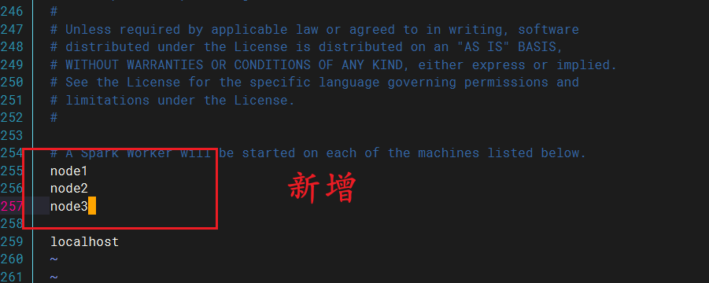

⑥配置spark-env.sh文件

先改名字

```shell
[hadoop@node1 conf]$ mv spark-env.sh.template spark-env.sh
```

```shell
[hadoop@node1 conf]$ vim spark-env.sh
```

将这个配置文件粘贴在后面；

```python
# 1. 改名
mv spark-env.sh.template spark-env.sh

# 2. 编辑spark-env.sh, 在底部追加如下内容

## 设置JAVA安装目录
JAVA_HOME=/export/server/jdk

## HADOOP软件配置文件目录，读取HDFS上文件和运行YARN集群
HADOOP_CONF_DIR=/export/server/hadoop/etc/hadoop
YARN_CONF_DIR=/export/server/hadoop/etc/hadoop

## 指定spark老大Master的IP和提交任务的通信端口
# 告知Spark的master运行在哪个机器上
export SPARK_MASTER_HOST=node1
# 告知sparkmaster的通讯端口
export SPARK_MASTER_PORT=7077
# 告知spark master的 webui端口
SPARK_MASTER_WEBUI_PORT=8080

# worker cpu可用核数
SPARK_WORKER_CORES=1
# worker可用内存
SPARK_WORKER_MEMORY=1g
# worker的工作通讯地址
SPARK_WORKER_PORT=7078
# worker的 webui地址
SPARK_WORKER_WEBUI_PORT=8081

## 设置历史服务器
# 配置的意思是  将spark程序运行的历史日志 存到hdfs的/sparklog文件夹中
SPARK_HISTORY_OPTS="-Dspark.history.fs.logDirectory=hdfs://node1:8020/sparklog/ -Dspark.history.fs.cleaner.enabled=true"
```

给sparklog赋予777权限

```shell
[hadoop@node1 conf]$ hadoop fs -chmod 777 /sparklog
chmod: changing permissions of '/sparklog': Permission denied. user=hadoop is not the owner of inode=/sparklog
```

解决办法：切换为root用户，进行赋予权限；

```shell
[hadoop@node1 conf]$ su - root
密码：
上一次登录：四 12月 19 15:46:12 CST 2024从 192.168.88.1pts/0 上
[root@node1 ~]# hadoop fs -ls /
Found 7 items
drwxr-xr-x   - root supergroup          0 2021-10-24 23:07 /flink
drwxr-xr-x   - root supergroup          0 2021-10-24 17:38 /hbase
drwxr-xr-x   - root supergroup          0 2021-10-24 16:02 /spark
drwxr-xr-x   - root supergroup          0 2024-12-18 19:49 /sparklog
drwxr-xr-x   - root supergroup          0 2021-10-24 22:19 /test
drwxrwx---   - root supergroup          0 2021-10-24 16:10 /tmp
drwxr-xr-x   - root supergroup          0 2021-10-24 16:09 /user
[root@node1 ~]# hadoop fs -chmod 777 /sparklog
```

查看权限更改的结果；已经更改为777权限；

```shell
[root@node1 ~]# hadoop fs -ls /
Found 7 items
drwxr-xr-x   - root supergroup          0 2021-10-24 23:07 /flink
drwxr-xr-x   - root supergroup          0 2021-10-24 17:38 /hbase
drwxr-xr-x   - root supergroup          0 2021-10-24 16:02 /spark
drwxrwxrwx   - root supergroup          0 2024-12-18 19:49 /sparklog
drwxr-xr-x   - root supergroup          0 2021-10-24 22:19 /test
drwxrwx---   - root supergroup          0 2021-10-24 16:10 /tmp
drwxr-xr-x   - root supergroup          0 2021-10-24 16:09 /user
您在 /var/spool/mail/root 中有新邮件
```

⑦配置`spark-defaults`

先修改名字

```shell
[hadoop@node1 conf]$ mv spark-defaults.conf.template spark-defaults.conf
```

```shell
[hadoop@node1 conf]$ vim spark-defaults.conf
```

```shell
# 开启spark的日期记录功能
spark.eventLog.enabled 	true
# 设置spark日志记录的路径
spark.eventLog.dir	 hdfs://node1:8020/sparklog/ 
# 设置spark日志是否启动压缩
spark.eventLog.compress 	true
```

在粘贴中会将注释都粘贴过去，可以使用`:set paste`

⑧配置`log4j.properties.template`

```shell
[hadoop@node1 conf]$ mv log4j.properties.template log4j.properties
```

```shell
[hadoop@node1 conf]$ vim log4j.properties
```

将`INFO` 更改为 `WARN`

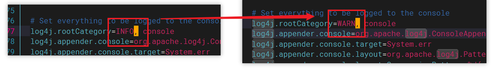

#### Spark分发

①将Spark分发到另外两个机器上

```shell
[hadoop@node1 server]$ scp -r spark-3.2.0-bin-hadoop3.2 node2:`pwd`/
```

显示操作失败，这个时候可以切换为root用户，进行操作；

```shell
[root@node1 server]# scp -r spark-3.2.0-bin-hadoop3.2 node2:`pwd`/
```

```shell
[root@node1 server]# scp -r spark-3.2.0-bin-hadoop3.2 node3:`pwd`/
```

以上均复制完成后；

②给复制过去的spark起一个软连接；

在node2窗口中切换到Hadoop用户；

```shell
(pyspark) [root@node2 ~]# su - hadoop
su: user hadoop does not exist

(pyspark) [root@node2 ~]# sudo useradd -m hadoop -s /bin/bash
您在 /var/spool/mail/root 中有新邮件

(pyspark) [root@node2 ~]# su - hadoop
最后一次失败的登录：四 12月 19 16:44:32 CST 2024从 node1ssh:notty 上
最有一次成功登录后有 1 次失败的登录尝试。
[hadoop@node2 ~]$ cd /export/server
```

给新复制过来的起一个软连接

```shell
[hadoop@node2 server]$ ln -s /export/server/spark-3.2.0-bin-hadoop3.2 /export/server/spark
ln: 无法创建符号链接"/export/server/spark/spark-3.2.0-bin-hadoop3.2": 权限不够
[hadoop@node2 server]$ su - root
密码：
上一次登录：四 12月 19 15:06:28 CST 2024pts/0 上
[root@node2 ~]# ln -s /export/server/spark-3.2.0-bin-hadoop3.2 /export/server/spark
```

在node3中起一个软连接

```shell
[root@node3 server]# ln -s /export/server/spark-3.2.0-bin-hadoop3.2 /export/server/spark
```

③准备启动spark集群；

进入spark目录中启动

```shell
[root@node1 spark]# sbin/start-history-server.sh 
mv: 无法获取"spark-env.sh.template" 的文件状态(stat): 没有那个文件或目录
starting org.apache.spark.deploy.history.HistoryServer, logging to /export/server/spark/logs/spark-root-org.apache.spark.deploy.history.HistoryServer-1-node1.itcast.cn.out

failed to launch: nice -n 0 /export/server/spark/bin/spark-class org.apache.spark.deploy.history.HistoryServer
full log in /export/server/spark/logs/spark-root-org.apache.spark.deploy.history.HistoryServer-1-node1.itcast.cn.out
```

显示创建失败，按照视频弹幕给jdk创建一个软连接；

```shell
[root@node1 spark]# ln -s /export/server/jdk1.8.0_241 /export/server/jdk
```

运行jps查看

```shell
[root@node1 spark]# jps
20898 HistoryServer
9106 ResourceManager
8469 NameNode
8653 DataNode
49821 HistoryServer
50269 Jps
9295 NodeManager
```

显示`jobHistoryServer`未启动，可以按照弹幕进行启动

```shell
[root@node1 spark]# mapred --daemon start    historyserver
```

然后再使用jps进行查看；显示启动成功；

```shell
[root@node1 spark]# jps
20898 HistoryServer
9106 ResourceManager
8469 NameNode
50393 Jps
50364 JobHistoryServer
8653 DataNode
49821 HistoryServer
9295 NodeManager
```

能够看到有两个historyserver在运行，那一个是spark所运行的呢？需要结合进程查看；

```shell
[root@node1 spark]# ps -ef | grep 50364
root      50364      1 21 13:32 pts/0    00:01:29 /export/server/jdk1.8.0_241//bin/java -Dproc_historyserver -Djava.net.preferIPv4Stack=true -Dmapred.jobsummary.logger=INFO,RFA -Dyarn.log.dir=/export/server/hadoop/logs -Dyarn.log.file=hadoop-root-historyserver-node1.itcast.cn.log -Dyarn.home.dir=/export/server/hadoop -Dyarn.root.logger=INFO,console -Djava.library.path=/export/server/hadoop/lib/native -Dhadoop.log.dir=/export/server/hadoop/logs -Dhadoop.log.file=hadoop-root-historyserver-node1.itcast.cn.log -Dhadoop.home.dir=/export/server/hadoop -Dhadoop.id.str=root -Dhadoop.root.logger=INFO,RFA -Dhadoop.policy.file=hadoop-policy.xml -Dhadoop.security.logger=INFO,NullAppender org.apache.hadoop.mapreduce.v2.hs.JobHistoryServer
root      50561  50156  0 13:39 pts/0    00:00:00 grep --color=auto 50364
```

能够看出这个程序是运行在`export/server/handoop/`里面的就是属于yarn的历史服务器；

那剩下的进程就是spark的历史服务器；

------

以上历史服务器启动完成后，再次启动整个spark集群；pyspark连接连接到整个集群

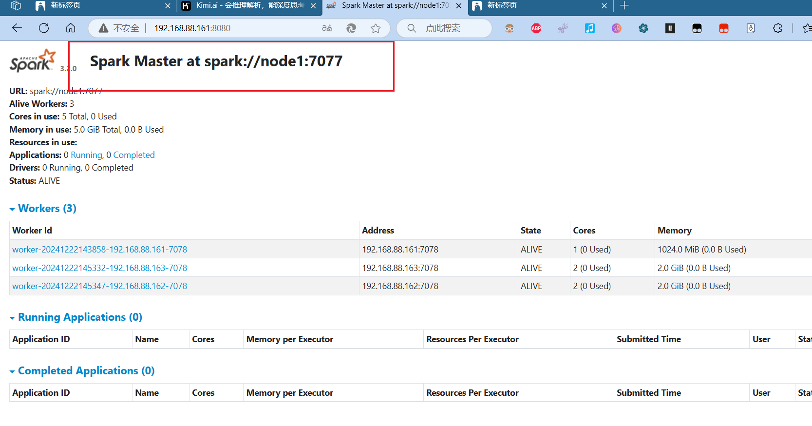

```
[root@node1 bin]# ./pyspark --master spark://node1:7077
```

```python
Python 3.8.20 (default, Oct  3 2024, 15:24:27) 
[GCC 11.2.0] :: Anaconda, Inc. on linux
Type "help", "copyright", "credits" or "license" for more information.
24/12/22 15:29:24 WARN NativeCodeLoader: Unable to load native-hadoop library for your platform... using builtin-java classes where applicable
Welcome to
      ____              __
     / __/__  ___ _____/ /__
    _\ \/ _ \/ _ `/ __/  '_/
   /__ / .__/\_,_/_/ /_/\_\   version 3.2.0
      /_/

Using Python version 3.8.20 (default, Oct  3 2024 15:24:27)
Spark context Web UI available at http://node1:4040
Spark context available as 'sc' (master = spark://node1:7077, app id = app-20241222152929-0000).
SparkSession available as 'spark'.
>>> 
```

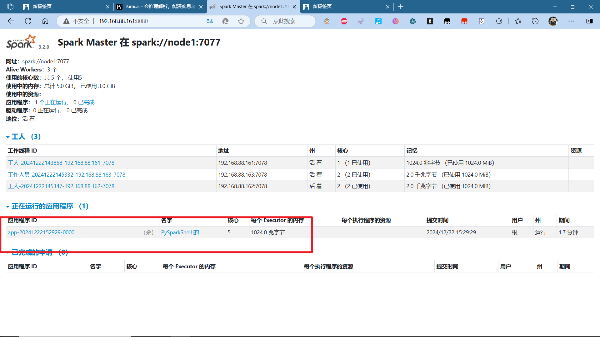

显示一个程序 正在运行 中

```python
>>> sc.parallelize([1,2,3,4,5]).map(lambda x:x * 10).collect()
[10, 20, 30, 40, 50]  
```

```python
hadoop@node1 bin]$ ./spark-submit --master spark://node1:7077 /export/server/spark/examples/src/main/python/pi.py 100
24/12/22 15:40:53 WARN NativeCodeLoader: Unable to load native-hadoop library for your platform... using builtin-java classes where applicable
Pi is roughly 3.145880
```

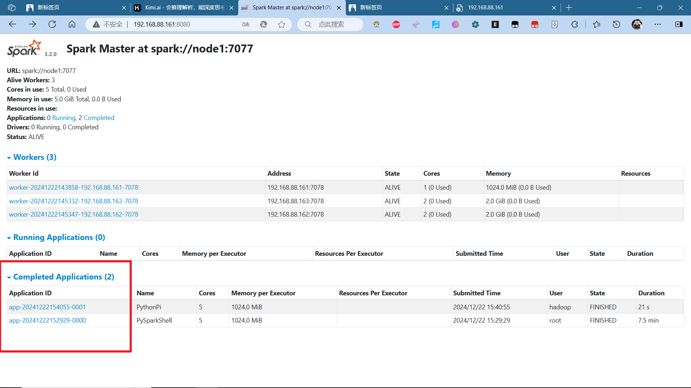

### 总结

standalone的原理？

> master和worker角色以独立进程的形式存在，并组成spark运行时 环境（集群）

spark角色在standalone中的分布？

> - master角色：master进程；
> - worker角色：worker进程；
> - driver角色：以线程运行存在master中；
> - executor角色：以线程运行在worker中；

standalone如何提交spark应用？

> bin/spark-submit --master spark://server:7077

4040/8080/18080分别是什么？

> 4040是单个程序运行的时候绑定的端口可供查看本任务运行情况

job/state/task的关系？

> 一个spark程序会被分成多个子任务（job）运行，每一个job会分成多个state（阶段）来运行，每一个state内会分出多个task（线程）来执行具体任务；
